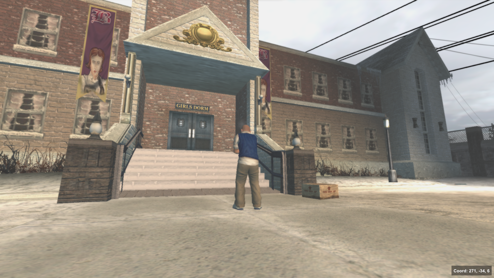

# Locations

## Academy Building



<figure><figcaption>
Academy Building Exterior
</figcaption></figure>

Area ID: 0

Interior Coordinates:  224, -74, 7



<figure><figcaption>
Academy Building Interior
</figcaption></figure>

Area ID: 2

Interior Coordinates:  -629, -324, 0



## **Boys Dorm**




<figure><figcaption>
Boys Dorm Interior
</figcaption></figure>

Area ID: 14

Interior Coordinates:  -502, 314, 31




<figure><figcaption>
Boys Dorm Exterior
</figcaption></figure>

Area ID: 0

Coordinates: 271, -108, 6



## Girls Dorm



<figure><figcaption></figcaption></figure>

Area ID: 0

Interior Coordinates:  271, -34, 16



<figure><figcaption>
Girls Dorm Interior
</figcaption></figure>

Area ID: 35

Interior Coordinates:  -437, 313, -8


